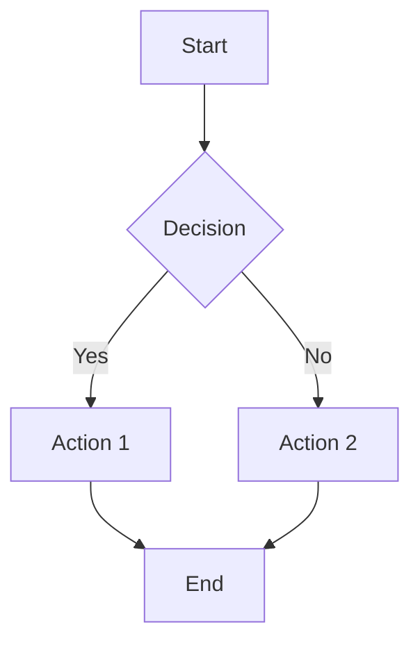
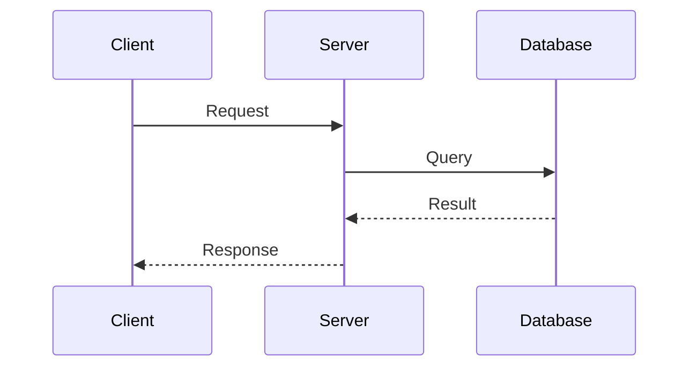
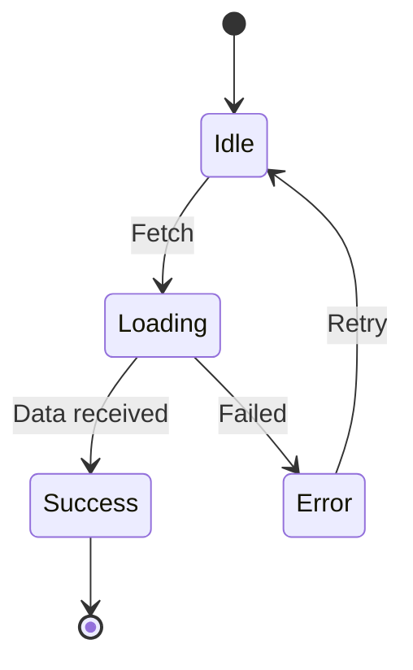
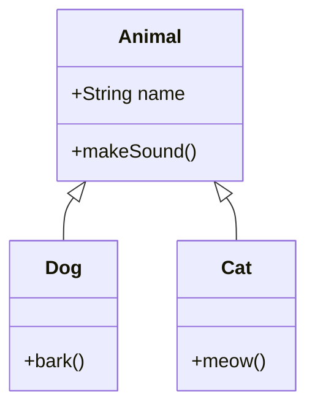
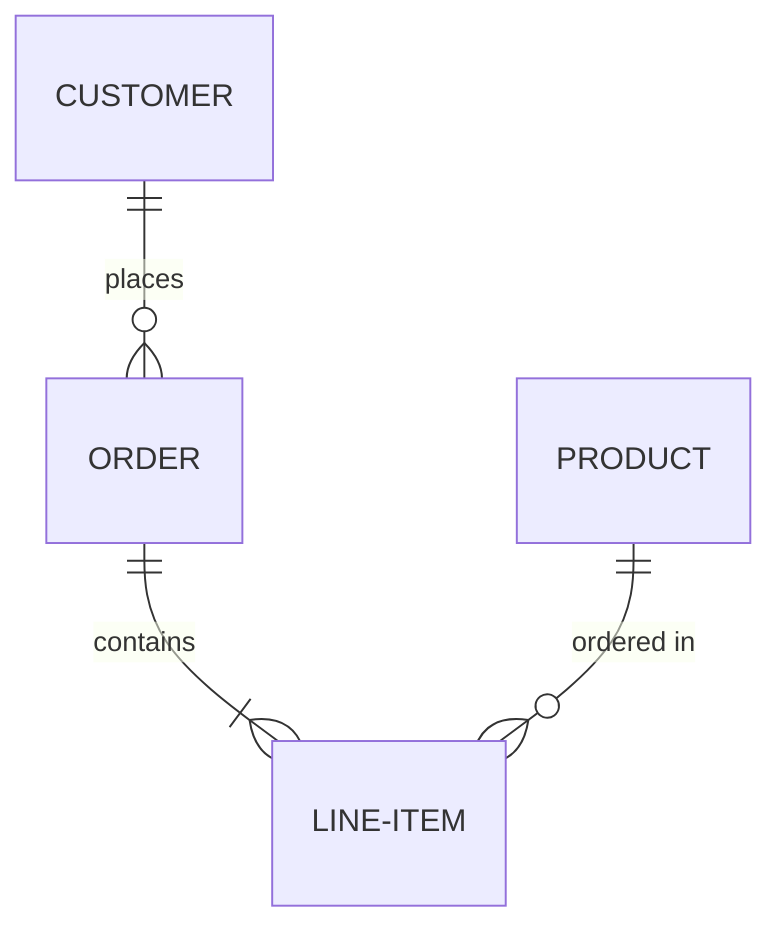
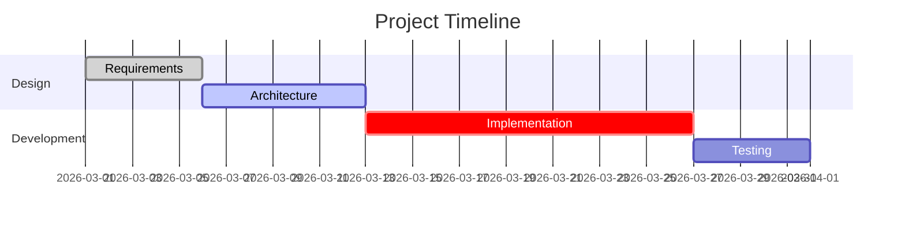
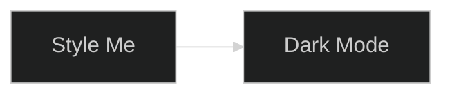
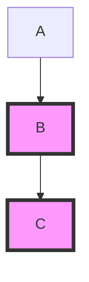

# Mermaid Diagram Skill

Use Mermaid diagrams as the default visual documentation standard. Diagrams live in markdown, diff cleanly in git, render natively on GitHub/GitLab/Notion.

## Diagram Types

### Flowchart

### Sequence Diagram

### State Diagram

### Class Diagram

### ER Diagram

### Gantt Chart

## Theming & Styling

### Custom CSS Classes

## Workflow Integration

Use diagrams to document:
- **Architecture**: System components and data flow
- **Processes**: Business logic and decision trees  
- **Sequences**: API calls and user interactions
- **States**: Object lifecycle and transitions
- **Data Models**: ERD and class relationships

## Best Practices

1. Keep labels short and descriptive
2. Use subgraphs to group related nodes
3. Choose direction (TD/BT/LR/RL) based on content
4. Add styling for emphasis on key nodes
5. Include both light and dark mode compatibility

## Quick Reference

| Type | Keyword | Best For |
|------|---------|----------|
| Flow | `flowchart` | Decision trees, processes |
| Sequence | `sequenceDiagram` | API calls, interactions |
| State | `stateDiagram-v2` | Object lifecycle |
| Class | `classDiagram` | Type relationships |
| ER | `erDiagram` | Database schema |
| Gantt | `gantt` | Project timelines |
| Pie | `pie` | Distribution visualization |
